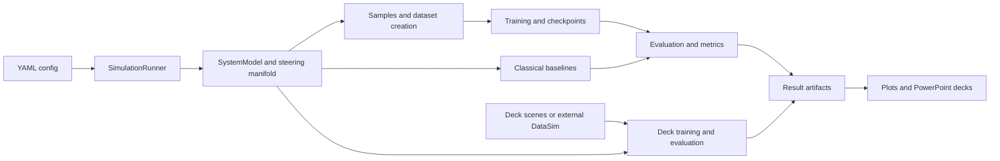

# DUNCS project context and Claude-to-Codex handoff

Snapshot: **2026-09-14**, `C:/GitHub/DUNCS`, branch **Magnaton**, HEAD
**c823b7f** (2026-09-09). The branch was 38 commits ahead of its locally cached
`origin/Magnaton`; no fetch was performed. This document records inspection,
not a fresh scientific evaluation. Refresh changing facts before continuing.

## Where we actually left off

The latest substantive Claude request was **"fix the doa former bug"**, after
requests to evaluate external DataSim data, explain earlier bugs in the deck,
and reorganize the project under `Code/`. The task is still unresolved.

The recovered conversation ends **2026-09-10 23:49 UTC / September 11 02:49
Israel time**. Although its JSONL file was modified September 14, that is not a
later user conversation. Claude's last message said DU training was at epoch
61/80 with DoAFormer training and evaluation queued. The actual logs now show
both trainings and the evaluation **completed**:

| Recovered run | Result observed in existing log |
|---|---|
| `rt_du_ds3.log` | DU `--datasim`, 80 epochs; saved `du_150MHz_datasim.pt`, best validation loss 15.7407 |
| `rt_dfm_real.log` | DoAFormer `--real`, 100 epochs; saved `doaformer_150MHz_real.pt`, best validation loss 4.8141 |
| `eval_real2.log` | Completed evaluation on 400 external DataSim single-source instances |
| `chain2.log` | Both checkpoints saved; `CHAIN2DONE` |

Validation losses above are logged training objectives; do not substitute them
for evaluation RMS in degrees.
No matching DUNCS training/evaluation Python process was found during the
migration inspection. A future session must recheck process state.

Existing `eval_real2.log` measurements (degrees; not rerun during migration):

| Method | RMS | Median absolute error | p90 | Signed bias |
|---|---:|---:|---:|---:|
| ML beamscan | 1.18 | 0.62 | 1.95 | 0.19 |
| Classical MUSIC | 1.18 | 0.62 | 2.00 | 0.19 |
| MFOCUSS | 1.17 | 0.64 | 1.98 | 0.19 |
| SPICE / IAA | 1.53 | 0.67 | 2.05 | 0.06 |
| SubspaceNet-MUSIC | 1.45 | 0.67 | 2.26 | -0.07 |
| DoAFormer, synthetic-trained | 32.71 | 4.32 | 71.65 | -4.94 |
| DoAFormer, DataSim-trained (`real-tr`) | **52.02** | **31.19** | **76.26** | **23.58** |

This run covered azimuth -63.4 to 64.1 degrees and SNR 5.6 to 84.6 dB
(median 28.9). The new checkpoint did not fix the observed DoAFormer failure.
These are diagnostic observations, not a valid held-out benchmark: the
training/evaluation overlap described below must also be resolved.

### Recovered outstanding user requests

1. Fix the DoAFormer failure on external DataSim inputs and verify the result.
2. Complete evaluation, the explanation of earlier bugs, and the presentation
   section documenting fixes and failed attempts. Refresh all applicable decks
   after corrected results; do not preserve stale success claims.
3. Finish/review the titled subsection comments through meaningful methods;
   several batches are committed, and another staged batch remains.
4. Move non-Git/non-environment project contents under `Code/` for a cleaner
   transferable tree. Claude explicitly deferred this; **not started**. Resolve
   hard-coded paths/imports/output locations as part of that eventual task.

These are recovered requests, not actions performed by this documentation
migration. `tasks.md` ends at Task 40 (the older ~273 MHz front-only study),
has an empty In Progress section, and omits this later sequence. Its remaining
DUNCS-on-field-data backlog is historical, not the latest priority.

## Project purpose and architecture

DUNCS began as Deep Unfolded Sparse Covariance ADMM for DoA Recovery. It now
compares learned covariance/subspace models, unfolded dictionary methods, and
classical sparse/subspace/ML estimators. The current presentation is titled
**MFOCUSS AI Improvements**.



| Location | Role and relevant details |
|---|---|
| `main.py` | YAML selector; defaults to `mfocuss`, then calls `SimulationRunner.run()` |
| `run_simulation.py` | Builds system/model/data; trains or loads; evaluates; supports scenario sweeps |
| `src/config/simulation_config.py` | OmegaConf dataclasses, config merge/interpolation, explicit 150 MHz carrier default |
| `src/system_model.py` | Array geometry and recorded `sSteering` loading/cache |
| `src/steering_vector_generator.py` | Recorded, analytic far-field, and near-field steering; singleton must be reset between systems |
| `src/sparse_array.py` | MRA geometry, difference co-array, virtual ULA utilities |
| `src/signal_creation.py` | `Samples`: signal and noise templates |
| `src/data_handler.py` | Dataset creation, SNR/snapshot materialization, batches grouped by source count |
| `src/models.py` | `ModelGenerator` factory |
| `src/training.py` | Training parameter builder and loop; per-model training steps; best-checkpoint handling |
| `src/evaluation.py`, `src/eval/reporting.py` | Neural/augmented/classical evaluation and reports |
| `src/methods_pack/` | MUSIC, ESPRIT, Root-MUSIC, covariance reconstruction |
| `src/metrics/criterions.py`, `crb.py` | Permutation-invariant losses and CRB |
| `deck/` | Later canonical scene generation, retraining, scoring, MATLAB visualizations, slide builder |
| `tests/test_antenna_pattern.py` | Existing analytic/recorded manifold checks |
| `presentation/` | Older local presentation assets; current builder lives under `deck/` |
| `data/` | Generated datasets, checkpoints, result MAT/JSON/NPZ files and figures; major subdirectories are Git-ignored |

CLI configuration mapping:

| `main.py` argument | YAML | Factory key |
|---|---|---|
| `duncs` | `src/config/DUNCS.yaml` | `DUNCS` |
| `subspacenet` | `src/config/subspaceNet.yaml` | `SubspaceNet` |
| `sparsenet` | `src/config/sparseNet.yaml` | `SparseNet` |
| `dumfocuss` | `src/config/duMfocuss.yaml` | `DUMFOCUSS` |
| `mfocuss` | `src/config/mfocuss.yaml` | `MFOCUSS` |
| `doaformer` | `src/config/doaFormer.yaml` | `DoAFormer` |

Additional factory keys: `SPICE`, `DA-MUSIC`, `DR_MUSIC`, `DeepCNN`,
`DCDMUSIC`, `TransMUSIC`. Implementations live in `src/models_pack/`.
DUNCS unfolds covariance ADMM; DU-MFOCUSS learns dictionary-solver parameters;
SubspaceNet learns a covariance surrogate; DoAFormer consumes covariance and/or
snapshot tokens. Current SubspaceNet YAML uses `music_1D`, not the historical
ESPRIT default. Benchmark scripts override several YAML model parameters.

### Workflows that should not be conflated

- `main.py` and `compare_models.py` use the generic training pipeline and its
  legacy random training/validation split. `compare_models.py` currently
  compares **DUNCS with SubspaceNet**, despite the older Claude description.
- `train_single_model.py` requires `--model_name` and `--config_path` pointing
  to YAML; it does not directly read `models_config.json`. Its recorded-pattern
  path uses disjoint recorded-angle pools and exports MAT results.
- `deck/doa_scenes.py` / `retrain_150.py` / `eval_150.py` implement the later
  continuous-angle benchmark and separate training recipes.
- `deck/retrain_150.py --real` and `deck/eval_real.py` load external DataSim
  MATLAB files. Their current shared source pool is **not disjoint**.

## Canonical benchmark and recent completed work

The corrected protocol in `deck/eval_150.py` uses actual **150 MHz**, five
sensors, eight snapshots, common **[-70, 70] degree** grids, and explicit RNG.
`deck/doa_scenes.py` uses SNR U(25,30) dB, weaker-source power U(0.3,1),
source coherence 0.9 for the correlated scenarios, and uniformly sampled pair
separation [15,40] or [25,40] degrees. The working-tree echo coherence default
is now separately **0**; that is an uncommitted modeling change.

Five scenarios: single, reuse15, reuse25, multipath15, multipath25. Three
columns: Synth-to-Synth, Synth-to-Sim, Sim-to-Sim. Here **Sim means parametric
scenes generated in `doa_scenes.py`**, not the external DataSim files.
Ten methods: beamscan ML, joint ML, AP ML, MUSIC, MFOCUSS, SPICE/IAA,
SubspaceNet-MUSIC, DoAFormer, DU-MFOCUSS, and guarded DU-MFOCUSS.

The deck scorer uses Hungarian matching, all-source error, detected-only
error, and MD, with the detection threshold bounded by half the separation.
`eval_150.py` clips all-source errors at 90 degrees before computing its
`RMS_all`; this is not uncapped RMS and differs from `eval_real.py`'s RMS.
Generic RMSPE is in radians with modulo-pi wrapping and is a different metric.
Plain `mfocuss.yaml` still uses a full +/-180-degree grid, so its scores cannot
be substituted for the equal-grid benchmark.

Recent Git evidence:

| Commit | Meaning |
|---|---|
| `6c9f2f5` (Sep 6) | SubspaceNet-MUSIC training/readout window and coherent-pair fixes; later recipe uses `cell_size_frac=0.025` |
| `fa00e88` (Sep 7) | MFOCUSS source-dependent sparsity floor: 0.01 for singles, 0.6 for pairs |
| `17b3c35` (Sep 7) | Deck explains two distinct coherences and multipath comparisons |
| `2780942` (Sep 8) | Removes dead MFOCUSS `p`/`lam` arguments; actual scheduled parameters remain |
| `e0a9c9a`, `77674a6`, `c823b7f` (Sep 9) | Section comments through algorithm core, metrics, and pipeline |

Older memory/deck passages about a winning wide MUSIC training window, 343 or
273 MHz benchmarks, and early back-lobe studies are historical. Consult the
matching recipe/results before reusing any number or conclusion.

## Existing working changes preserved during migration

| Git state at arrival | File(s) | Intent |
|---|---|---|
| Staged deletion | `DUNCS.7z` | Pre-existing archive removal; do not restore or include in a new commit accidentally |
| Staged and unstaged | `deck/doa_scenes.py` | Staged explanatory comments; unstaged independent echo-coherence parameter/default and waveform mixture |
| Staged modifications | `deck/eval_150.py`, `run_simulation.py`, `src/evaluation.py`, `src/system_model.py`, `src/utils.py` | Pipeline/scoring explanatory comments |
| Unstaged | `deck/retrain_150.py` | External DataSim `--real` training; normalized singles/superposed pairs; DU `eval_chunk=32` |
| Unstaged | `src/models_pack/du_mfocuss.py` | Restore full-batch `_last_spectrum` after chunked refinement |
| Untracked | `deck/eval_real.py` | External DataSim single-source diagnostic; prints results, including optional DataSim-trained DoAFormer |

The migration only adds `AGENTS.md`, this context file, and
`.agents/skills/matlab-coding-conventions/` files. It does not stage, commit,
move code, modify source, delete Claude files, or rerun experiments.

## Risks and concrete next checks

1. **DoAFormer remains broken in the recorded diagnostic.** Training
   RMS-normalizes loaded snapshots (`deck/retrain_150.py:72`), while evaluation
   passes raw amplitudes (`deck/eval_real.py:56`). Internal covariance
   normalization divides by the Frobenius norm plus `1e-6`
   (`src/models_pack/doa_former.py:125`), so it is amplitude-dependent at low
   signal powers. A read-only amplitude audit of the same 400 selected inputs
   found median covariance-token norm **0.001222**, with **251/400 below 0.01**;
   normalized training inputs give approximately unit norm. The mismatch is
   confirmed; its contribution to the 52-degree failure is not yet measured.
   Compare the same checkpoint on raw versus RMS-normalized inputs before
   attributing the failure to propagation. Also verify units, checkpoint
   architecture, loss/readout, and input consistency for any superposed pairs.
2. **Split overlap:** `retrain_150.py` shuffles files with seed 0, takes 900,
   and draws both train and validation examples from one pool. `eval_real.py`
   uses the same sorted files/shuffle seed and reads the earliest instances.
   Define persistent disjoint source-file/instance splits before interpreting
   generalization; train/evaluation seeds alone do not prevent overlap.
3. **Stale benchmark artifacts:** `eval_150.json` is dated Sep 9 20:00, while
   replaced DataSim checkpoints are dated Sep 10-11 and echo defaults changed.
   Rescore with recorded provenance before refreshing result claims.
4. **Incomplete external-data comparison:** `eval_real.py` currently excludes
   DU-MFOCUSS and evaluates only single-source instances. It prints a table
   rather than saving a structured benchmark artifact.
5. **Training diagnostics:** the retrainer catches backward `RuntimeError` and
   silently skips batches. Check skipped/failing batches before trusting loss.
   The DU cache patch followed an OOM and then a batch-shape failure; exercise
   both chunked and unchunked behavior during the eventual fix.
6. **Scene assumptions:** the new echo coherence default changes distributions.
   Evaluate/document the intended propagation model; "real multipath always
   decorrelates" is not an established fact.
7. **Analytic steering inconsistency:** far-field generator uses `+2j`, while
   MUSIC's analytic fallback uses `-2j`. Recorded nonsparse MUSIC uses the
   shared measured generator. Investigate when touching analytic/sparse paths;
   no sign change was made during this migration.
8. **Artifact collisions:** generic dataset/checkpoint names omit carrier and
   manifold identity; smoke retraining uses normal output filenames. Preserve
   known weights and isolate diagnostic outputs before launching a run.

Recommended continuation order: reproduce the DoAFormer failure on a small,
explicitly identified sample; verify preprocessing/checkpoint equivalence;
establish disjoint evaluation; fix and validate; rescore the relevant methods;
update plots/decks and progress history; then perform the requested `Code/`
restructure with path/import checks. This ordering is a recommendation based
on recovered requests and current evidence.

## Environment, data, and commands

Verified local environment: Windows PowerShell; `.venv/Scripts/python.exe`
is Python **3.12.4**, PyTorch **2.6.0+cpu**, CUDA **unavailable**. NumPy,
OmegaConf, and PyYAML are available. **pytest and python-pptx are absent from
this venv**, and both are absent from `requirements.txt`. No packages were
installed for this migration. Historical jobs may have used a different
interpreter; do not assume this venv reproduces their execution environment.

| Path | Purpose / inspected availability |
|---|---|
| `C:/GitHub/Hof/Auxiliary/Data/Steering/ULA3/SteeringData_Mid.mat` | Present; measured complex `sSteering.A[N,az,freq]`, `phi`, `freq`; Mid band 136-550 MHz |
| `C:/GitHub/DOA_AI_Data/DataSim` | Present; external simulator MAT data, `sTrainingData.inputSignal`, `sGT.Az`, `SNR` |
| `data/weights/` | Present; ignored checkpoints, including `doaformer_150MHz_real.pt` |
| `data/simulations/results/eval_150.json` | Present; older canonical benchmark table |
| `data/simulations/Plots/` | Current deck figure inputs; distinct from generic results/plots paths |
| `G:/My Drive/DOA_AI` | Present; current presentation outputs |
| `G:/My Drive/DUNCS`, repository `Temp/` | Not present; old references should not be reused blindly |

Run from the repository root. These commands describe workflows; none of the
training/evaluation/deck commands were run during migration:

```powershell
# Inspect CLI arguments without training.
.\.venv\Scripts\python.exe -B train_single_model.py --help

# Existing focused tests, after pytest is available in the chosen environment.
.\.venv\Scripts\python.exe -B -m pytest tests/test_antenna_pattern.py -q -p no:cacheprovider

# Config-controlled simulation; inspect commands/training/output paths first.
.\.venv\Scripts\python.exe main.py mfocuss

# Standalone training example; this trains and writes artifacts.
.\.venv\Scripts\python.exe train_single_model.py --model_name DUNCS --config_path src/config/DUNCS.yaml

# Canonical benchmark and external-data diagnostic; inspect checkpoints first.
.\.venv\Scripts\python.exe deck/eval_150.py
.\.venv\Scripts\python.exe deck/eval_real.py
```

Retraining entry point is `deck/retrain_150.py <du|music|doaformer>` with
`--datasim`, `--real`, and optional MUSIC `--cell 0.025`. These modes have
different data provenance. `--smoke` is not safe for canonical weights as
currently implemented. Generic training also saves checkpoints even when
`commands.save_model` is false; that flag gates an additional final-model save.
EarlyStopping exists but its use in the training loop is commented out.

### Presentation rebuild map

`deck/build_deck.py` writes directly to the Drive folder and creates output
directories at import, so do not import it as a passive check. It needs
python-pptx and matplotlib. `deck/doa_plots_correct.py` still references an old
Claude scratchpad path that will need attention when reviving that workflow.

Nine known variants: base, `LEAN_V1`, `OUT_V2`, `OUT_V3`; each of those four
also has a `BULLETS_ALL=1` twin; and `COMPACT_HM=1` (Compact Heatmap).
Set only the intended variant flag for each build, and clear/restore flags
between runs. The canonical corrected compact output is
`G:/My Drive/DOA_AI/MFOCUSS_AI_Improvements_Compact_Heatmap.pptx`.
The last Claude report said the compact deck had bug-history updates but the
other eight variants still awaited final rescoring/rebuilds. That claim was
not independently verified by rendering all decks during this migration.

## Migration sources and format decisions

| Source | Codex destination / treatment |
|---|---|
| `CLAUDE.md` | `AGENTS.md` for durable instructions; this document for corrected architecture and status |
| `.claude/skills/matlab-coding-conventions/SKILL.md` | `.agents/skills/matlab-coding-conventions/SKILL.md`, scoped Hof/Exhaustive reference, and optional `agents/openai.yaml` UI metadata |
| `.claude/agents/fable5.md` | Reviewed; generic delegation guidance is covered in `AGENTS.md`. Its Claude-only model selector is not copied into Codex configuration |
| Claude project `memory/*.md` | Relevant user preferences consolidated into `AGENTS.md`; dated technical claims checked against code/logs or marked historical |
| Claude session JSONL and scratchpad logs | Recovered pending user requests and actual completed-run outcomes above; no full conversation copied into the repo |

Claude project memory source:
`C:/Users/Daniel/.claude/projects/C--GitHub-DUNCS/memory/`.
Session file in the parent directory:
`64e8dd82-9435-48e6-a804-bb899502d269.jsonl`.
Run logs inspected under:

```text
C:/Users/Daniel/AppData/Local/Temp/claude/c--GitHub-DUNCS/
64e8dd82-9435-48e6-a804-bb899502d269/scratchpad/
```

The original Claude files remain unchanged. The MATLAB skill's external
repository rules are conditional, its hard-coded historical next-task number
is replaced by reading the current ledgers, and its task rotation is not
applied to DUNCS `tasks.md`. Historical claims that learning cannot underperform
classical methods or residual selection guarantees DoA improvement are not
promoted to scientific guarantees.

Codex format references checked during migration:
[project instructions with AGENTS.md](https://learn.chatgpt.com/docs/agent-configuration/agents-md)
and [local skills and discovery](https://learn.chatgpt.com/docs/build-skills).
The repository uses the documented `.agents/skills/<name>/SKILL.md` location
and YAML `name`/`description`. Codex loads project instructions at session
startup; start a new session to check automatic loading of `AGENTS.md`.
Skills can be invoked explicitly as `$matlab-coding-conventions`; if discovery
does not refresh, restart the session. No global Codex configuration was changed.

## Migration verification

- The bundled skill validator passed. New files passed UTF-8, relative-link,
  YAML metadata, and whitespace checks.
- All 55 existing Python source files parsed without syntax errors, without
  executing workflows or writing bytecode. Existing invalid-escape warnings
  in `src/plotting.py` remain unchanged.
- Git index-entry and tracked working-diff hashes match their pre-migration
  values. The only new files are the Codex instructions, context, and skill.
- Runtime tests, model inference/training, and presentation builds were not
  run. The existing pytest suite needs a pytest installation; this migration
  does not claim the scientific workflows or tests pass.
